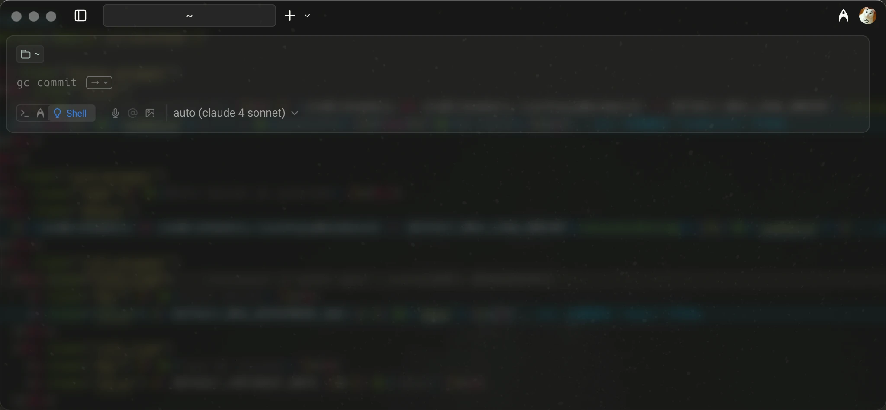

# gc-commit 🚀

> 规范 Git 提交的命令行工具



---

## 一、简介

gc-commit 是一个基于 Node.js 的命令行工具，帮助你快速生成符合规范的 commit message，并自动执行 `git add .` 、 `git commit` 和 `git push`，让团队协作更高效，历史记录更清晰。


## 二、使用方法
### 安装
```bash
npm install -g gc-commit
```

### 快速提交

```bash
gc commit
# 或者
gc cm
```

### 交互流程
1. 自动执行 `git add .`
2. 选择提交类型（type）
3. 输入影响范围（scope）
4. 输入简要描述（subject）
5. 自动生成并提交 commit message


## 三、命令说明

| 命令         | 说明                       |
| ------------ | -------------------------- |
| `gc commit`  | 自动 add 并生成规范 commit |
| `gc cm`      | 同上，别名                 |


## 四、Commit 规范

格式：
```
<type>(<scope>): <subject>
```

- **type**：提交类型（如 feat、fix、docs 等）
- **scope**：影响范围（如模块、文件等，可自定义）
- **subject**：简要描述（必填）

常见 type 选项：
- feat:     新功能
- fix:      修复 bug
- docs:     文档变更
- style:    代码格式
- pref:     性能优化
- refactor: 代码重构
- test:     添加或修改测试
- chore:    构建过程或辅助工具变动


---

## License

MIT
